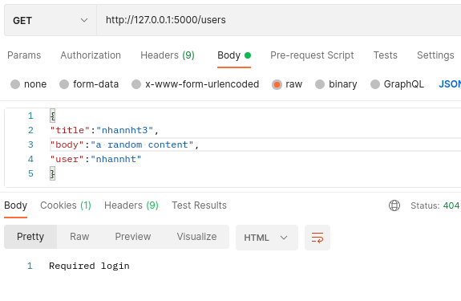

- [x] TODO : Authentication
- [x] TODO : Add blog, add image ,add data
- [x] TODO: update blog, update image update date

### All api:
- [x] POST /posts
  
- [x] GET /posts/deleteAll
  
- [x] GET /posts/delete/:postId

  

- [x] GET /post/create

- [x] GET /users
  
- [x] POST /users/signup
  
- [x] POST /users/login

  
- [x] POST /users/delete/:userId
  
- [x] GET /users/:userId

